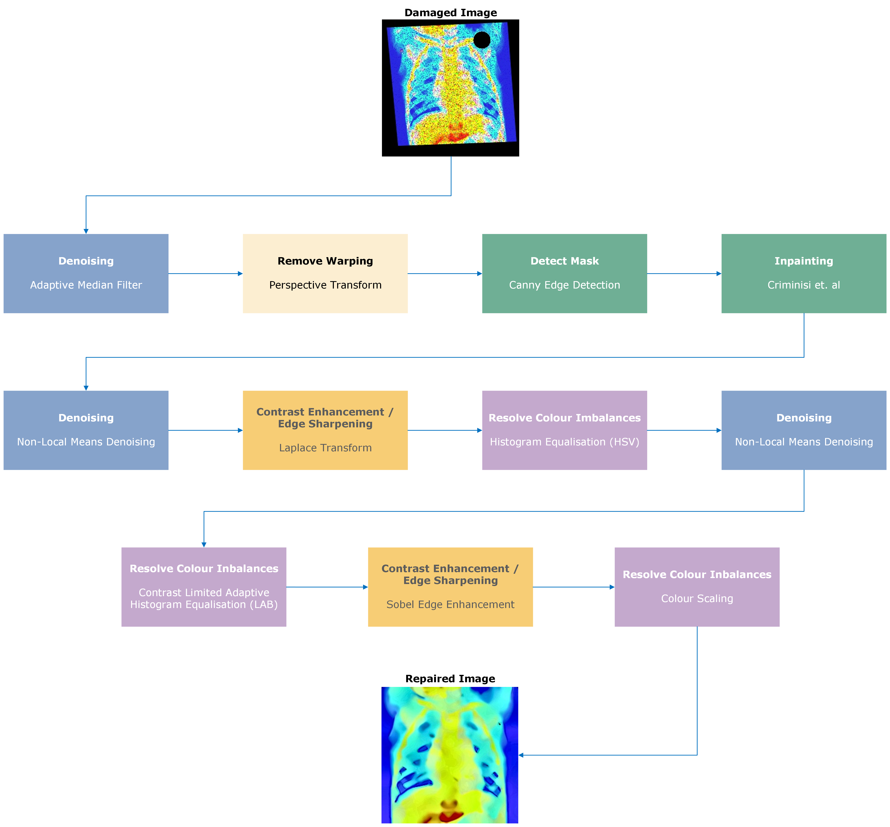
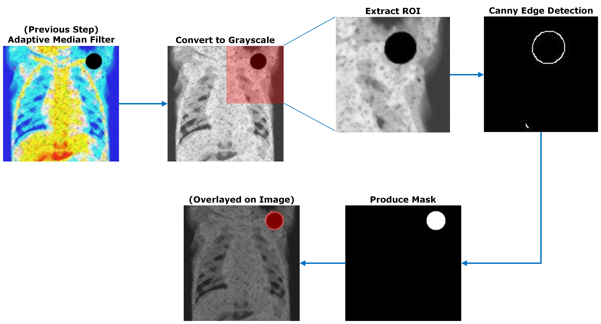
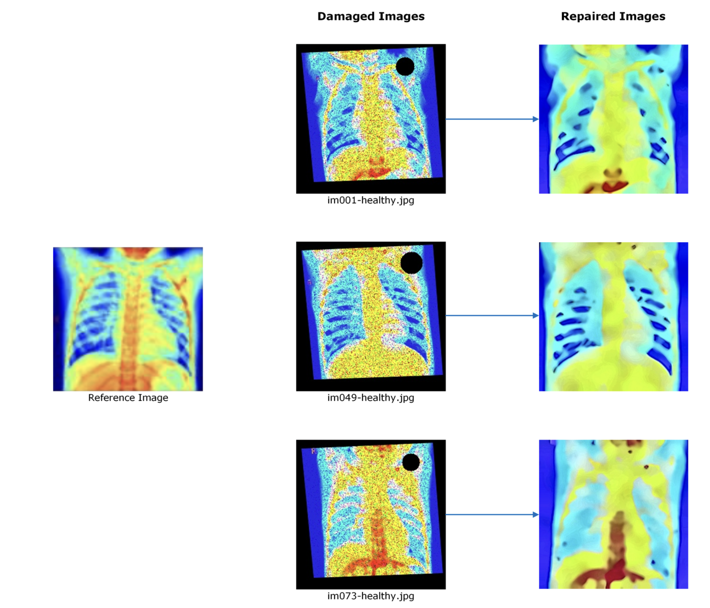

# Repairing X-ray Images With OpenCV and Python



This repo contains my project as part of my image processing coursework, where I developed a solution to repair damaged X-ray images using OpenCV and Python. The goal was to improve the performance of a pretrained classifier by enhancing the image quality of the X-rays.

## Introduction
In medical imaging, particularly with X-rays, the presence of artifacts or damage can reduce the accuracy of classifiers used for diagnostics. This project focuses on repairing damaged X-ray images to improve the performance of a pretrained classifier. By utilizing OpenCV, the project restores image quality, making it easier for classifiers to process the images accurately.

The images were artificially damaged, with warping, noise (both gaussian and salt and pepper), and colour imbalances present. There was also a missing section in each image, with a different size and location, requiring significant inpainting.

In order to detect missing regions, I made use of Canny Edge Detection, as seen in the below flowchart:


## Technologies
OpenCV
NumPy
Matplotlib

## Project Structure
image_processing_files - stores the damaged images, as well as the pretrained classifier `classifier.py`
report_assets - includes images and diagrams for use in my report
Results - stores the repaired images

report.pdf - describes and describes the approach made
main.py - main project to clean X-ray images
Inpainter.py - Criminisi implementation from Nahar https://github.com/NazminJuli/Criminisi-Inpainting

## Installation
Clone the repository:
``` Bash
git clone https://github.com/jsduxie/opencv-xray-repair
```

Install the required dependencies:
``` Bash
pip install -r requirements.txt
```

## Usage
All damaged images are stored in `image-processing-files/x-ray_images`.

To run:
```Bash
python3 main.py [directory]
```
Where `directory` is the relative path to the folder containing the damaged (input) images.

To confirm the results with the pre-trained classifier:
``` Bash
cd image_processing_files
python3 classifier.py [directory]
```
Where `directory` is the relative path to the folder containing the repaired (outputted) images.

## Results
With this method, I was able to achieve a classifier accuracy of 0.90, with a baseline of 0.55 for unrepaired images. Using OpenCV's `inpaint()` method achieved a classifier accuracy of 0.93, at the cost of less convincing inpainting.

The application of Criminisi's algorithm via https://github.com/NazminJuli/Criminisi-Inpainting proved invaluable when combined with my use of Canny edge detection to detect missing regions.



## Acknowledgements
The Criminisi Inpainter implementation was provided by @NazminJuli - https://github.com/NazminJuli/Criminisi-Inpainting

## License
Feel free to demo this code, however please provide credit if you use or build upon this :)